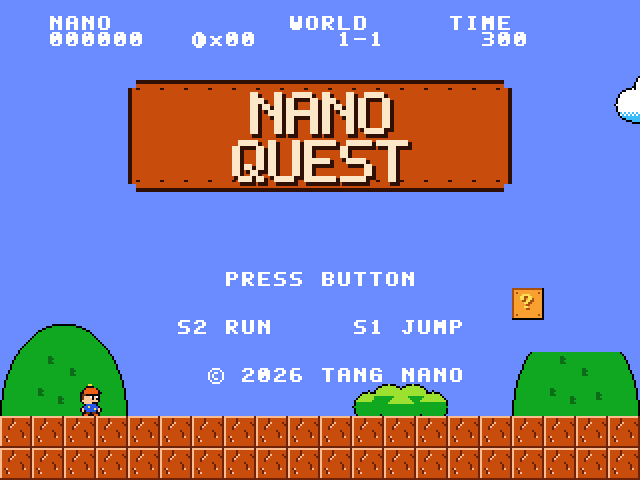
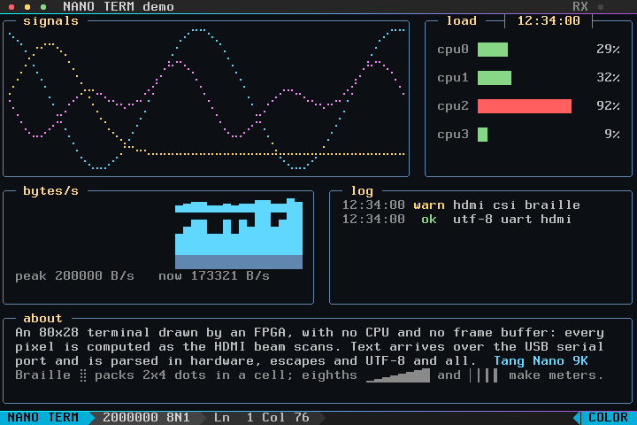
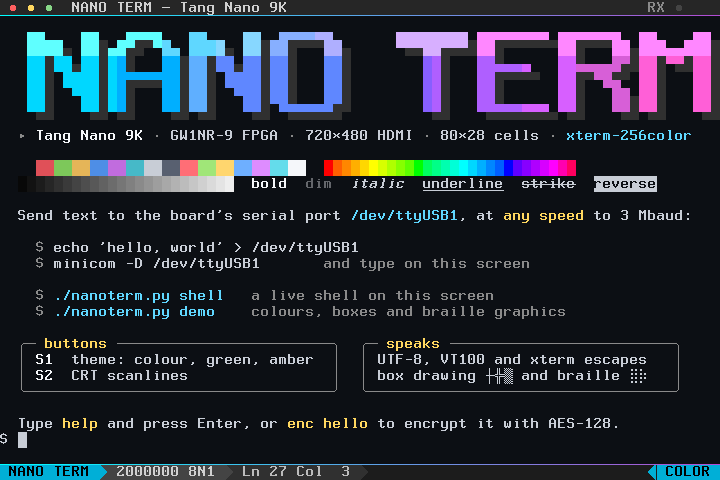
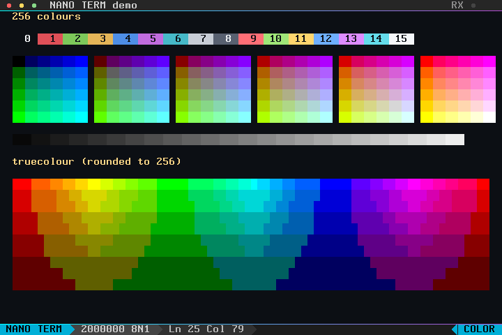
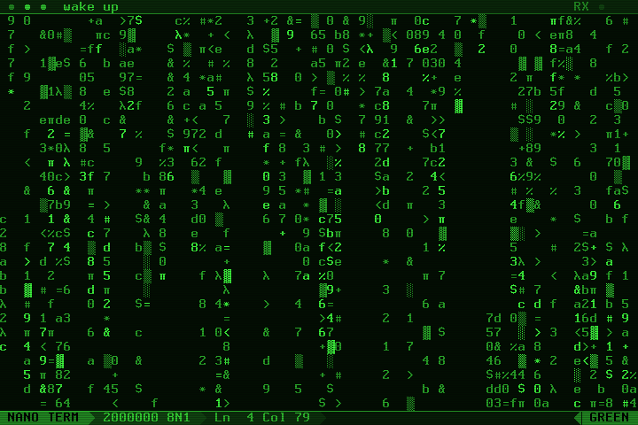

# Tang Nano 9K experiments

FPGA designs for the Sipeed Tang Nano 9K (Gowin GW1NR-9C), built entirely with the open-source
toolchain. They go from blinking LEDs up to a full-screen animated pixel-art scene, Pong on a
simulated arcade CRT, NANO QUEST, a small NES-style platformer, and NANO TERM, a serial terminal
that runs vim and top, all drawn live by the FPGA over HDMI.



**How it works:** [an interactive explainer](https://stephenkingston.github.io/tang-nano-9k/) walks through
NANO QUEST's HDMI output, pixel pipeline, game logic, sound and tests, with live demos built from the
game's real tiles, sprites and level.

## Designs

| Folder | What it does |
|---|---|
| `blink/` | The six onboard LEDs fill up one at a time, then empty in reverse |
| `hdmi/bars/` | 640×480 colour bars |
| `hdmi/logo/` | An anti-aliased logo bouncing around the screen; the LEDs flash on a perfect corner hit |
| `hdmi/sunset/` | A parallax pixel-art sunset over a lake |
| `hdmi/pong-classic/` | Pong against the computer on a monochrome arcade CRT |
| `hdmi/platformer/` | NANO QUEST: run, jump, stomp slimes, collect coins and reach the flag |
| `hdmi/terminal/` | NANO TERM: a terminal on the USB serial port, with UTF-8, 256 colours, xterm escape sequences, and a built-in shell that does AES-128 in hardware |
| `hdmi/common/` | Shared HDMI output, DSP multiplier wrapper, pin constraints and build rules |
| `docs/` | The explainer page (GitHub Pages); `page_data.py` copies the game's data into it |

### The sunset


The GIF (12 seconds from power-up, at 20 fps) and a
**[longer 30-second video (media/scene.mp4)](media/scene.mp4)** are rendered with the Python
reference model, which matches the hardware pixel for pixel, so they are exactly what the board
shows. `make gif` and `make video` in `hdmi/sunset` regenerate them.

The scene is 320×240 pixels, each drawn as a 2×2 block on a 640×480 @ 60 Hz screen. There is no
frame buffer: the FPGA computes the colour of every pixel as the screen is scanned out, 25.2
million times a second.

- **Sky:** Bayer-dithered sunset gradient, a sun with a dithered glow, and a star map with twinkling stars.
- **Layers:** clouds, mountains, forested hills and a foreground shore are 512-pixel-wide strips in
  block RAM (2 bits per pixel). Each scrolls at its own speed for parallax depth.
- **Water:** the bottom third mirrors everything above the horizon. A ripple table shifts each row
  sideways by an amount that grows towards the viewer, and hashed sparkles glitter under the sun.
- **Birds:** a flock of three two-frame sprites flaps across the sky.
- **Colour:** every layer resolves to one of 64 palette entries; the water uses darker, bluer copies
  of the scene colours.

It uses 23 of the 26 block RAMs and about 11% of the logic, and meets timing at 43 MHz against
the 25.2 MHz pixel clock.

### NANO QUEST


A side-scrolling platformer in the style of the 8-bit classics, with original pixel art. Hold
**S2** to run right and press **S1** to jump (hold it for a higher jump). Bump `?` blocks for
coins; a few hold a mushroom that rises out of the block and slides away, and eating it makes
Nano big (16×32), so a slime hit only shrinks Nano back instead of costing a life. Smash bricks
from below (they burst into four flying chunks), grab floating coins, stomp slimes, don't fall
down the pits, and reach the flagpole
before the time runs out; the time left turns into points and the next world starts. 100
coins give an extra life. Score, coins, world and time sit at the top; there is a title screen,
a world card with your lives, and GAME OVER. The LEDs show your lives and a piezo buzzer
between pin 25 and GND plays the sound effects.

The picture is 320×240 (each pixel 2×2 on screen) built from 16×16 tiles, 16×16 sprites and
an 8×8 font, all generated by `platformer_gen.py` along with the level. The level lives in a
dual-port block RAM: the renderer reads it for every pixel while the game reads and writes it
(coins disappear, `?` blocks get used up, bricks get smashed), and a pristine copy restores it
for each new life.
After every frame the game runs a sequence of steps, one per clock, reading the level one tile
at a time for collisions. It uses about a quarter of the logic and 15 block RAMs and meets
timing at 50 MHz.

The GIF above is recorded from the Verilog itself: `make gif` has the bot fetch the first
mushroom and play on in simulation, saving every other frame, so it is exactly what the board
draws.

`make sim` first has a scripted bot walk under the first mushroom block, bump it and wait for
the mushroom, then the bot plays world 1 as big Nano and world 2 small: it always runs and
jumps at walls, pits and slimes. The test fails unless Nano grows (keeping the feet in place),
a slime hit on big Nano shrinks it without costing a life, both worlds are cleared, the hero
never ends up inside a solid tile, never jumps in mid-air and never loses the ground while
standing, and every smashed brick is really gone from the level. Then it renders the title, world
card, gameplay and course-clear screens to PNG.

### NANO TERM



A terminal for the board's USB serial port: whatever is sent to it appears on an 80×28 character
screen over HDMI, under a title bar and above a status bar. It is a real terminal rather than a
text printer. It understands UTF-8 and the VT100/xterm escape sequences that shells, editors and
ncurses programs use, so vim, less, man, nano and top run on it (`TERM=xterm-256color`). It
starts as a tiny shell of its own, so you can also just type at it:

```
$ enc attack at dawn
89fc2ea14333a74c6319ab8d763d2829
$ dec 89fc2ea14333a74c6319ab8d763d2829
attack at dawn
$ help
  help            this list
  clear           clear the screen
  theme           the next colour theme: colour, green or amber
  crt             CRT scanlines on or off
  key <hex>       set the AES-128 key: 32 hex digits
  iv <hex>        set the CBC initial vector: 32 hex digits
  enc <text>      encrypt the text (AES-128-CBC, PKCS#7 padding), in hex
  dec <hex>       decrypt that hex back to text
  ...
```

```sh
cd hdmi/terminal
make load                                   # or make flash
echo 'hello, world' > /dev/ttyUSB1          # the board's second USB serial port, at any speed
minicom -D /dev/ttyUSB1                     # type at its built-in shell, at any speed
./nanoterm.py shell                         # your shell on the HDMI screen, typed from this keyboard
./nanoterm.py type                          # type at the built-in shell without minicom
./nanoterm.py demo                          # the demo above
```



- **Screen:** 720×480 @ 60 Hz in 9×16-pixel character cells, as in VGA text mode: the 9th
  column keeps letters apart, and box-drawing and block characters continue into it so lines join.
- **Characters:** an original 8×16 font with ASCII and Latin-1 (accented letters are composed),
  box drawing, block elements, arrows, shapes, check marks and powerline separators. Braille
  (2×4 dots a cell, for graphs) is drawn straight from the dot pattern. Double-width characters
  such as CJK and emoji take two cells as a placeholder, so programs' layouts stay right.
- **Colour and attributes:** 256 colours (24-bit colour is rounded to the 6×6×6 cube), bold (as bright
  colours), dim, italic (slanted), underline, blink, strike-through and reverse.
- **Escape sequences:** cursor movement, erasing, scroll regions, inserting and deleting
  characters and lines, insert mode, repeat, tabs, the DEC line-drawing set, the alternate screen,
  saved cursors, cursor shapes, reverse screen and window titles (shown in the title bar). It
  answers cursor-position and device-attribute queries on the serial port's other direction.
- **Any serial speed:** 9600 to 3000000 baud, found from the line itself (see below).
- **Bars:** the title bar shows the window title and a light for received data; the status bar
  shows the serial speed, the cursor position and the colour theme.
- **Built-in shell:** a `$ ` prompt for typing at the terminal directly (see below).
- **Buttons:** S1 cycles the colour theme (colour, green phosphor, amber phosphor), and held for
  half a second brings the built-in shell back; S2 toggles CRT scanlines. LEDs: receiving,
  sending, measuring the speed, overrun.




Bytes go from the UART into a 2 KB FIFO, and the terminal engine, a state machine, parses them
and edits a screen memory of 62 rows × 80 cells: the main screen, the alternate screen and the
two bars, with each cell's glyph, colours and attributes in 32 bits. The engine takes a step
every other clock (see below for why) and writes one cell a step. Scrolling rotates a table of
rows instead of moving text, so it costs 80 steps (blanking the new row) whatever the scroll
region. The renderer reads each cell once per 9 pixels (the engine has the read port the rest
of the time), looks up the font and the palette, and adds the effects six clocks behind the
beam; there is no frame buffer. `nanoterm.py shell` runs your shell in an 80×28 pseudo-terminal,
passes your keys to it and its output to the board, and the board's replies back to the shell.

There is no speed to set (9600, 19200, 38400, 57600, 115200, 230400, 460800, 1 M, 2 M and
3 Mbaud all work). The bytes are decoded from a copy of the line delayed by 0.6 ms (10 ms for
the speeds up to 38400), while a second receiver watches the live line. A framing error, or a
pulse clearly shorter than a bit, starts a measurement of the live line: the shortest of the
next few pulses is one bit, which picks the speed. That takes less time than the delay, so the
first byte sent at a new speed is decoded at the new speed: nothing is lost, and nothing is
shown decoded at the wrong speed. This also sidesteps a quirk of the board's USB chip, a BL702
posing as an FTDI chip, which only switches to a new baud rate the next time the port is opened.

At power-up the terminal is a tiny shell for typing at it directly, since normally a terminal's
keys go to a computer that decides what to show. It shows a `$ ` prompt; Backspace (BS or DEL)
rubs out, and Enter reads the line back from the screen, from the prompt over every row it
wrapped onto, and runs it: `help`, `clear`, `theme`, `crt`, or one of the AES commands below.
Arrow and editing keys are ignored. What the shell prints comes from a small text ROM and goes
through the terminal like received text, so the help can use colours. Any other escape sequence
means a program is driving the terminal, and the shell steps aside until `CSI ? 2112 h` (which
`nanoterm.py` sends when it finishes) or S1 held down brings it back.

The shell also does AES-128 in CBC mode with PKCS#7 padding, in hardware. `key` and `iv` take 32
hex digits (spaces allowed), `enc` encrypts the rest of its line and prints the ciphertext in
hex, and `dec` takes the hex back (it can wrap over several rows) and prints the text, or says
the padding is wrong, which is what a wrong key or IV usually gives. The key and IV start as
the example ones in NIST SP 800-38A, so the board agrees with OpenSSL straight away:

```sh
printf 'attack at dawn' | openssl enc -aes-128-cbc -K 2b7e151628aed2a6abf7158809cf4f3c \
    -iv 000102030405060708090a0b0c0d0e0f | xxd -p    # 89fc2ea14333a74c6319ab8d763d2829
```

The AES unit (`term_aes.v`) works a byte at a time, which keeps it to about 400 logic cells: the
S-box and its inverse are a ROM in one block RAM, and a second block RAM holds the round keys
(worked out once when the key is set), the IV, the state and the text. Each round gathers a
column's four bytes (ShiftRows and SubBytes on the way in), then writes them back through
MixColumns and the round key one byte at a time. Decryption runs the inverse round and goes
through the blocks last first, so it can work in place and each block's predecessor is still
ciphertext when it is needed. A block takes 866 clocks, about 0.5 MB/s. It is a demonstration,
not a way to protect secrets: the key is typed in plain view, and nothing guards against
timing or power analysis.

It uses 62% of the LUTs (plus 26% as adders) and 24 of the 26 block RAMs. That is a fairly full
chip. It is synthesised without the wide-LUT muxes (`-nowidelut`, which saves about 800 LUTs
here), and its LUT mapping leaves out a step of ABC9 that fails on this design
(`term_abc9.abc`). To make room for AES, the sums the shell used to do, the status bar's byte
counter, uptime and sparkline, and the grey ramp for 24-bit colour were taken out.

Two things about the real chip shaped the engine, and neither shows up in the tools:

- **Real delays are longer than nextpnr says.** Builds that nextpnr said met timing at around
  40 MHz misbehaved at 27 MHz, in ways that depended on placement: a scroll scrambled rows, or a
  line feed didn't move the cursor. The very same placement and routing worked with the clock
  slowed to 18 MHz. So the engine takes a step every other clock, and its logic has two clocks
  to settle.
- **A block RAM's read output doesn't hold still while its clock enable is low**, as the
  simulation models assume. So the engine keeps what it reads in registers.

Before those two changes, 2 of 11 builds worked on the board; after them, all 10 did. It is built
with placer seed 1, which nextpnr reports at 41 MHz against the 27 MHz pixel clock. If a build
can't place the design, or trips the clock-route check, try another `SEED=n`. Either way, check a
new build on the board with `make check`, because the tools can't vouch for it.

On the board, ordinary output keeps up at 3 Mbaud: 677 KB of text arrives in 2.94 s with the
screen exactly matching the model. A 483 KB stress stream made almost entirely of escape
sequences keeps up at 1 Mbaud. `make check` passes at speeds from 9600 to 3 Mbaud in turn without
a reload.

### Pong

You are the left paddle: **S1** moves up, **S2** moves down, and either button starts a game.
The computer plays the right paddle; first to 11 wins. When nobody is playing, the machine
plays itself under a blinking PRESS BUTTON. Where the ball hits your paddle sets its angle,
and the ball speeds up on every hit. A piezo buzzer between pin 25 and GND plays the blips.
The LEDs sweep in attract mode and show your score in binary during a game.

The picture goes through a barrel distortion (curved glass with rounded corners), in
monochrome phosphor with glow around the ball, paddles and walls, a fading ball trail,
scanlines, vignetting, static and a rolling hum bar. Hold both buttons for a second to switch
white, green and amber.


Yosys does not map multiplies to the Gowin DSP blocks, so `common/gowin_mult.v` instantiates
the `MULT18X18` primitive directly for the curvature, vignette and colour maths. The game
update is spread over four clocks after each frame so it meets timing.

### HDMI output

`common/dvi_tx.v` generates DVI (which every HDMI monitor accepts) with no external video chip.
The PLL turns the 27 MHz oscillator into a 126 MHz serial clock, `CLKDIV` divides it by 5 to the
25.2 MHz pixel clock, `tmds_encoder.v` does the TMDS 8b/10b encoding, and `OSER10` serialisers
drive the HDMI pins through emulated-LVDS buffers. A design only supplies a colour for each
`(x, y)` a fixed number of clocks later. `MODE=1` gives 720×480 instead (a 135 MHz serial clock
and 27 MHz pixel clock), which NANO TERM uses for its 9-pixel-wide character cells.

## Toolchain

Tested on Ubuntu 26.04, which packages everything:

```sh
sudo apt install make yosys nextpnr-himbaechel nextpnr-himbaechel-gowin-chipdb python3-apycula \
    openfpgaloader iverilog python3-pil fonts-dejavu-core ffmpeg
sudo usermod -aG dialout $USER     # for the board's serial port
```

The place-and-route binary is called `nextpnr-himbaechel-gowin`. openFPGALoader installs a udev
rule that gives the `plugdev` group access to the board.

## Building

Each design builds from its own folder:

```sh
cd hdmi/platformer
make           # build platformer.fs
make load      # load into SRAM (lost at power-off)
make flash     # write to flash (survives power-off)
make sim       # simulate (see below)
```

`blink/` has the same `make`, `make load` and `make flash` targets. Art and colour tables are
generated by each design's Python script during the build.

If the board ever shows up on USB as `ffff:ffff BLIOT CDC Virtual ComPort` instead of the
`0403:6010` JTAG debugger, the HDMI monitor is back-powering it: unplug USB **and** HDMI,
wait a few seconds, and plug USB in first. Unplug HDMI whenever you power-cycle the board.

The placer seed is fixed (`SEED=1`) because some placements stop the 126 MHz clock from reaching
`CLKDIV` over its dedicated route, which can break the video. The build checks for this and fails
with a message; rebuild with another `SEED=n` if it happens.

## Verification

- `make sim-tmds` (any HDMI folder): the TMDS encoder against an independent decoder: every byte
  value plus about 175,000 random words, exact control tokens, and bounded DC balance.
- `sunset/`, `make sim FRAME=n`: renders frame `n` in Icarus Verilog and compares all 307,200
  pixels with the Python model. Frames 7, 1200 and 23456 match exactly. `make video` renders
  `media/scene.mp4` from the model.
- `pong-classic/`, `make sim`: plays over 40,000 frames of game logic (machine vs machine, an
  idle player, a bot player, the colour switch) checking that paddles and ball stay on the field
  and games finish, then renders attract, in-game, game-over and green-phosphor frames to PNG.
- `platformer/`, `make sim`: the bot playthrough described above, plus screens rendered to PNG.
- `terminal/`, `make sim`: the terminal engine against the Python model (`term_model.py`) on
  every supported control and escape sequence, a session at the built-in shell (every command,
  AES with its error cases, and lines long enough to wrap, scroll and overflow), random streams
  of text, UTF-8 (valid and broken) and escape sequences, and any recorded sessions given to
  `term_test.py`. The screen, cursor, modes, both bars and every reply must match exactly,
  including screen checksums along the way. Then the serial port at the bit level: a sender
  changes speed (9600 to 3 Mbaud, some with its clock 2.5% off, and single keystrokes) and every
  byte must arrive intact, including those sent while the speed is measured. Then four frames
  rendered by the Verilog and compared pixel for pixel with the model's renderer (all three
  themes and the scanlines). The AES unit is also tested on its own against the FIPS-197 and
  NIST SP 800-38A vectors, the power-up key and IV, and random keys, IVs and texts up to the
  most blocks the shell can send. Recorded sessions of vim, less, man, nano, top and bash also
  matched, and the model agreed with pyte, an independent terminal emulator, on those sessions.
  With the board loaded, `make check` streams the same tests to it at full speed. After each
  part the FPGA sends back every cell on its screen (`CSI 998 n`) and the checksum, and both must
  match the model exactly; on a mismatch it prints the rows that differ.
