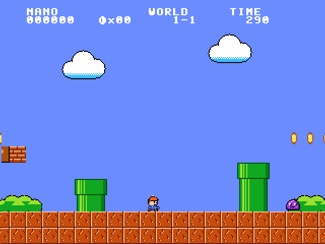
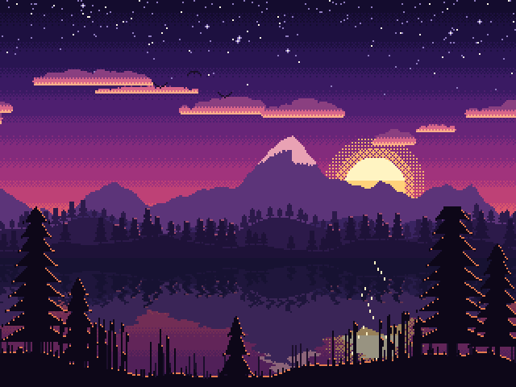
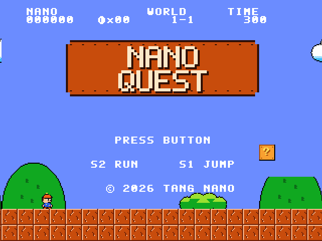
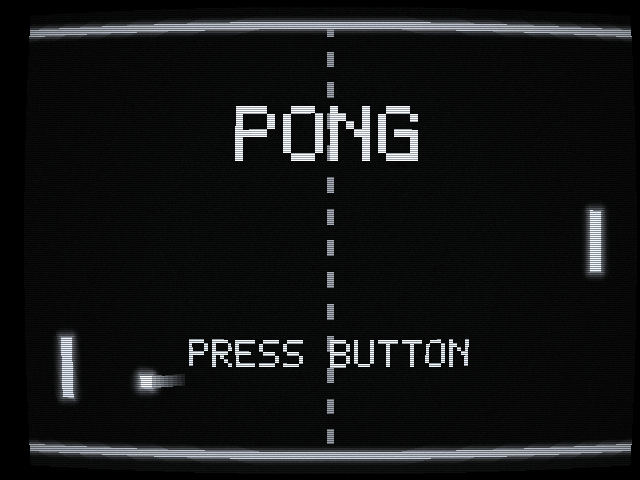

# Tang Nano 9K experiments

FPGA designs for the Sipeed Tang Nano 9K (Gowin GW1NR-9C), built entirely with the open-source
toolchain. They go from blinking LEDs up to a full-screen animated pixel-art scene, Pong on a
simulated arcade CRT and NANO QUEST, a small NES-style platformer, all drawn live by the FPGA
over HDMI and played with the board's two buttons.



## Designs

| Folder | What it does |
|---|---|
| `blink/` | The six onboard LEDs fill up one at a time, then empty in reverse |
| `hdmi/bars/` | 640×480 colour bars |
| `hdmi/logo/` | An anti-aliased logo bouncing around the screen; the LEDs flash on a perfect corner hit |
| `hdmi/sunset/` | A parallax pixel-art sunset over a lake |
| `hdmi/pong-classic/` | Pong against the computer on a monochrome arcade CRT |
| `hdmi/platformer/` | NANO QUEST: run, jump, stomp slimes, collect coins and reach the flag |
| `hdmi/common/` | Shared HDMI output, DSP multiplier wrapper, pin constraints and build rules |

### The sunset



**[Watch 30 seconds of it (media/scene.mp4)](media/scene.mp4).** The video was rendered with the
Python reference model, which matches the hardware pixel for pixel, so it is exactly what the
board shows from power-up.

The scene is 320×240 pixels, each drawn as a 2×2 block on a 640×480 @ 60 Hz screen. There is no
frame buffer: the FPGA computes the colour of every pixel as the screen is scanned out, 25.2
million times a second.

- **Sky:** Bayer-dithered sunset gradient, a sun with a dithered glow, and a star map with twinkling stars.
- **Layers:** clouds, mountains, forested hills and a foreground shore are 512-pixel-wide strips in
  block RAM (2 bits per pixel). Each scrolls at its own speed for parallax depth.
- **Water:** the bottom third mirrors everything above the horizon. A ripple table shifts each row
  sideways by an amount that grows towards the viewer, and hashed sparkles glitter under the sun.
- **Birds:** a flock of three two-frame sprites flaps across the sky.
- **Colour:** every layer resolves to one of 64 palette entries; the water uses darker, bluer copies
  of the scene colours.

It uses 23 of the 26 block RAMs and about 11% of the logic, and meets timing at 43 MHz against
the 25.2 MHz pixel clock.

### NANO QUEST



A side-scrolling platformer in the style of the 8-bit classics, with original pixel art. Hold
**S2** to run right and press **S1** to jump (hold it for a higher jump). Bump `?` blocks for
coins, grab floating coins, stomp slimes, don't fall down the pits, and reach the flagpole
before the time runs out; the time left turns into points and the next world starts. 100
coins give an extra life. Score, coins, world and time sit at the top; there is a title screen,
a world card with your lives, and GAME OVER. The LEDs show your lives and a piezo buzzer
between pin 25 and GND plays the sound effects.

The picture is 320×240 (each pixel 2×2 on screen) built from 16×16 tiles, 16×16 sprites and
an 8×8 font, all generated by `platformer_gen.py` along with the level. The level lives in a
dual-port block RAM: the renderer reads it for every pixel while the game reads and writes it
(coins disappear, `?` blocks get used up), and a pristine copy restores it for each new life.
After every frame the game runs a sequence of steps, one per clock, reading the level one tile
at a time for collisions. It uses about a quarter of the logic and 15 block RAMs and meets
timing at 50 MHz.

`make sim` has a bot play the course: it always runs and jumps at walls, pits and slimes. The
test fails unless the bot reaches the flag, the hero never ends up inside a solid tile, never
jumps in mid-air and never loses the ground while standing. Then it renders the title, world
card, gameplay and course-clear screens to PNG.

### Pong

You are the left paddle: **S1** moves up, **S2** moves down, and either button starts a game.
The computer plays the right paddle; first to 11 wins. When nobody is playing, the machine
plays itself under a blinking PRESS BUTTON. Where the ball hits your paddle sets its angle,
and the ball speeds up on every hit. A piezo buzzer between pin 25 and GND plays the blips.
The LEDs sweep in attract mode and show your score in binary during a game.

The picture goes through a barrel distortion (curved glass with rounded corners), in
monochrome phosphor with glow around the ball, paddles and walls, a fading ball trail,
scanlines, vignetting, static and a rolling hum bar. Hold both buttons for a second to switch
white, green and amber.



Yosys does not map multiplies to the Gowin DSP blocks, so `common/gowin_mult.v` instantiates
the `MULT18X18` primitive directly for the curvature, vignette and colour maths. The game
update is spread over four clocks after each frame so it meets timing.

### HDMI output

`common/dvi_tx.v` generates DVI (which every HDMI monitor accepts) with no external video chip.
The PLL turns the 27 MHz oscillator into a 126 MHz serial clock, `CLKDIV` divides it by 5 to the
25.2 MHz pixel clock, `tmds_encoder.v` does the TMDS 8b/10b encoding, and `OSER10` serialisers
drive the HDMI pins through emulated-LVDS buffers. A design only supplies a colour for each
`(x, y)` a fixed number of clocks later.

## Toolchain

Tested on Ubuntu 26.04, which packages everything:

```sh
sudo apt install make yosys nextpnr-himbaechel nextpnr-himbaechel-gowin-chipdb python3-apycula \
    openfpgaloader iverilog python3-pil fonts-dejavu-core ffmpeg
sudo usermod -aG dialout $USER     # for the board's serial port
```

The place-and-route binary is called `nextpnr-himbaechel-gowin`. openFPGALoader installs a udev
rule that gives the `plugdev` group access to the board.

## Building

Each design builds from its own folder:

```sh
cd hdmi/platformer
make           # build platformer.fs
make load      # load into SRAM (lost at power-off)
make flash     # write to flash (survives power-off)
make sim       # simulate (see below)
```

`blink/` has the same `make`, `make load` and `make flash` targets. Art and colour tables are
generated by each design's Python script during the build.

If the board ever shows up on USB as `ffff:ffff BLIOT CDC Virtual ComPort` instead of the
`0403:6010` JTAG debugger, the HDMI monitor is back-powering it: unplug USB **and** HDMI,
wait a few seconds, and plug USB in first. Unplug HDMI whenever you power-cycle the board.

The placer seed is fixed (`SEED=1`) because some placements stop the 126 MHz clock from reaching
`CLKDIV` over its dedicated route, which can break the video. The build checks for this and fails
with a message; rebuild with another `SEED=n` if it happens.

## Verification

- `make sim-tmds` (any HDMI folder): the TMDS encoder against an independent decoder: every byte
  value plus about 175,000 random words, exact control tokens, and bounded DC balance.
- `sunset/`, `make sim FRAME=n`: renders frame `n` in Icarus Verilog and compares all 307,200
  pixels with the Python model. Frames 7, 1200 and 23456 match exactly. `make video` renders
  `media/scene.mp4` from the model.
- `pong-classic/`, `make sim`: plays over 40,000 frames of game logic (machine vs machine, an
  idle player, a bot player, the colour switch) checking that paddles and ball stay on the field
  and games finish, then renders attract, in-game, game-over and green-phosphor frames to PNG.
- `platformer/`, `make sim`: the bot playthrough described above, plus screens rendered to PNG.
